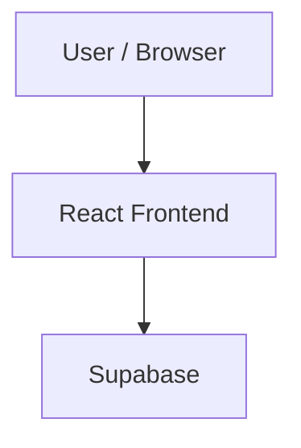

# TechNova

> File-based React application powered by TanStack Start, Supabase, and Tailwind CSS.

        

##  Table of Contents

- [Description](#description)
- [Key Features](#key-features)
- [Use Cases](#use-cases)
- [Screenshots](#screenshots)
- [Tech Stack](#tech-stack)
- [Architecture](#architecture)
- [Quick Start](#quick-start)
- [Key Dependencies](#key-dependencies)
- [Available Scripts](#available-scripts)
- [Project Structure](#project-structure)
- [Development Setup](#development-setup)
- [Deployment](#deployment)
- [Contributors](#contributors)
- [Contributing](#contributing)

##  Description

TechNova is a robust web application built on React, TanStack Start, and Supabase. It utilizes a file-based routing system to configure application layouts, dynamic routes, and splat routes directly from your directory structure, eliminating manual router declarations and streamlining frontend development. Under the hood, the stack leverages TanStack Query for asynchronous state management and server-state caching, combined with Tailwind CSS and Radix UI primitives for building accessible and visually consistent user interfaces. Form processing and type-safe validation are handled natively through React Hook Form and Zod schemas. Additionally, the codebase includes server-side entry points, a custom error-capturing architecture, and integration with the Lovable development platform to enable real-time visual synchronization directly with your repository's git history.

##  Key Features

- ** File-Based TanStack Routing** — Supports dynamic, optional, and splat routes automatically generated from the file structure in the routes directory.
- ** State Management with TanStack Query** — Manages, caches, and synchronizes asynchronous server state seamlessly with React components.
- ** Type-Safe Forms and Validation** — Combines React Hook Form with Zod schemas to guarantee strict runtime validation and type safety.
- ** Accessible UI with Radix** — Styles unstyled Radix UI primitives with Tailwind CSS for clean, highly accessible, and customized layouts.
- ** Supabase Backend Integration** — Connects to Supabase to leverage scalable database, authentication, and realtime features.
- ** Lovable Git Sync** — Maintains direct synchronization with the Lovable.dev visual development environment to sync design and code changes.

## Use Cases

- Building scalable web applications that require strict file-based routing and hybrid client-server rendering.
- Developing database-driven interfaces requiring instant visual synchronization through the Lovable editor.
- Creating type-safe user validation systems backed by robust form validation libraries and Supabase services.

##  Tech Stack

-  **React**
-  **Supabase**
-  **Tailwind CSS**
-  **TypeScript**
-  **Vite**

**Notable libraries:** Radix UI, React Hook Form, TanStack Query, Zod

##  Architecture

A high-level view of how the main pieces fit together:



##  Quick Start

```bash

# 1. Clone the repository
git clone https://github.com/ASHLEYN2005/TechNova.git

# 2. Install dependencies
pnpm install

# 3. Start the dev server
pnpm dev
```

##  Key Dependencies

```
@hookform/resolvers: ^5.2.2
@radix-ui/react-accordion: ^1.2.12
@radix-ui/react-alert-dialog: ^1.1.15
@radix-ui/react-aspect-ratio: ^1.1.8
@radix-ui/react-avatar: ^1.1.11
@radix-ui/react-checkbox: ^1.3.3
@radix-ui/react-collapsible: ^1.1.12
@radix-ui/react-context-menu: ^2.2.16
@radix-ui/react-dialog: ^1.1.15
@radix-ui/react-dropdown-menu: ^2.1.16
@radix-ui/react-hover-card: ^1.1.15
@radix-ui/react-label: ^2.1.8
@radix-ui/react-menubar: ^1.1.16
@radix-ui/react-navigation-menu: ^1.2.14
@radix-ui/react-popover: ^1.1.15
```
Available Scripts
dev — pnpm dev

build — pnpm build

build:dev — pnpm build:dev

preview — pnpm preview

lint — pnpm lint

format — pnpm format

 Project Structure

```
.
├── .lovable
│   └── project.json
├── bun.lock
├── bunfig.toml
├── components.json
├── eslint.config.js
├── index.html
├── package.json
├── pnpm-workspace.yaml
├── src
│   ├── assets
│   │   ├── compssa-logo.asset.json
│   │   ├── dp.jpeg
│   │   ├── image.jpeg
│   │   ├── lo.jpeg
│   │   ├── log.png
│   │   ├── logo.jpeg
│   │   └── logo.png
│   ├── components
│   │   ├── AppShell.tsx
│   │   ├── AuthCard.tsx
│   │   ├── Logo.tsx
│   │   ├── Sidebar.tsx
│   │   └── ui
│   │       ├── accordion.tsx
│   │       ├── alert-dialog.tsx
│   │       ├── alert.tsx
│   │       ├── aspect-ratio.tsx
│   │       ├── avatar.tsx
│   │       ├── badge.tsx
│   │       ├── breadcrumb.tsx
│   │       ├── button.tsx
│   │       ├── calendar.tsx
│   │       ├── card.tsx
│   │       ├── carousel.tsx
│   │       ├── chart.tsx
│   │       ├── checkbox.tsx
│   │       ├── collapsible.tsx
│   │       ├── command.tsx
│   │       ├── context-menu.tsx
│   │       ├── dialog.tsx
│   │       ├── drawer.tsx
│   │       ├── dropdown-menu.tsx
│   │       ├── form.tsx
│   │       ├── hover-card.tsx
│   │       ├── input-otp.tsx
│   │       ├── input.tsx
│   │       ├── label.tsx
│   │       ├── menubar.tsx
│   │       ├── navigation-menu.tsx
│   │       ├── pagination.tsx
│   │       ├── popover.tsx
│   │       ├── progress.tsx
│   │       ├── radio-group.tsx
│   │       ├── resizable.tsx
│   │       ├── scroll-area.tsx
│   │       ├── select.tsx
│   │       ├── separator.tsx
│   │       ├── sheet.tsx
│   │       ├── sidebar.tsx
│   │       ├── skeleton.tsx
│   │       ├── slider.tsx
│   │       ├── sonner.tsx
│   │       ├── switch.tsx
│   │       ├── table.tsx
│   │       ├── tabs.tsx
│   │       ├── textarea.tsx
│   │       ├── toggle-group.tsx
│   │       ├── toggle.tsx
│   │       └── tooltip.tsx
│   ├── hooks
│   │   ├── use-mobile.tsx
│   │   └── useNotifications.ts
│   ├── lib
│   │   ├── AppContext.tsx
│   │   ├── AppContextObject.tsx
│   │   ├── demo-auth.ts
│   │   ├── error-capture.ts
│   │   ├── error-page.ts
│   │   ├── lovable-error-reporting.ts
│   │   ├── store.ts
│   │   ├── supabase.ts
│   │   ├── useAppData.ts
│   │   ├── useAuth.ts
│   │   ├── useStudentFinance.ts
│   │   └── utils.ts
│   ├── main.tsx
│   ├── routeTree.gen.ts
│   ├── router.tsx
│   ├── routes
│   │   ├── __root.tsx
│   │   ├── activate.tsx
│   │   ├── admin.tsx
│   │   ├── dashboard.tsx
│   │   ├── forgot-password.tsx
│   │   ├── history.tsx
│   │   ├── import-students.tsx
│   │   ├── index.tsx
│   │   ├── login.tsx
│   │   ├── notifications.tsx
│   │   ├── payment-success.tsx
│   │   ├── payment.tsx
│   │   ├── profile.tsx
│   │   ├── receipts.tsx
│   │   ├── settings.tsx
│   │   └── update-password.tsx
│   ├── server.ts
│   ├── start.ts
│   └── styles.css
├── tsconfig.json
├── vercel.json
└── vite.config.ts
```

## 🛠️ Development Setup

### Node.js / JavaScript
1. Install Node.js (v18+ recommended)
2. Install dependencies: `npm install` (or `yarn` / `pnpm install` / `bun install`)
3. Start the dev server: see the **Quick Start** above

##  Deployment

### Vercel

This project is configured for [Vercel](https://vercel.com). Push to the connected branch or run `vercel` locally.

##  Contributors

Thanks to everyone who has contributed to this project:

<p align="left">
<a href="https://github.com/dums47" title="dums47"></a>
<a href="https://github.com/ASHLEYN2005" title="ASHLEYN2005"></a>
</p>

[See the full list of contributors →](https://github.com/ASHLEYN2005/TechNova/graphs/contributors)

##  Contributing

Contributions are welcome! Here's the standard flow:

1. **Fork** the repository
2. **Clone** your fork: `git clone https://github.com/ASHLEYN2005/TechNova.git`
3. **Branch**: `git checkout -b feature/your-feature`
4. **Commit**: `git commit -m 'feat: add some feature'`
5. **Push**: `git push origin feature/your-feature`
6. **Open** a pull request

Please follow the existing code style and include tests for new behavior where applicable.

---
NB: This application requires users to already exist in the studenttable and their work is to just activate their accounts,the required data for entering new record is their email,full name,current level, department id,role(The default role is student ) but can be made admin to fit needs,index number and then prog_id. All necesary logins would be included in the env files ie. Supabase.
